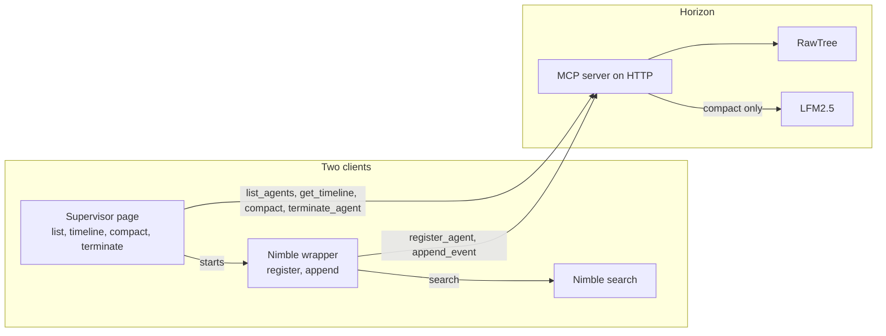

# Horizon

Horizon is the server in the middle. The supervisor and the Nimble wrapper are the only two clients, and they call different tools.

The supervisor page starts the Nimble wrapper. The wrapper registers the session, then searches and appends each result. The page lists that session, shows its timeline, compacts it, and can terminate it. LFM2.5 runs only on compact. Both clients store through the same MCP server.

---

Long Horizon Agents Hackathon
San Francisco
September 25, 2026.