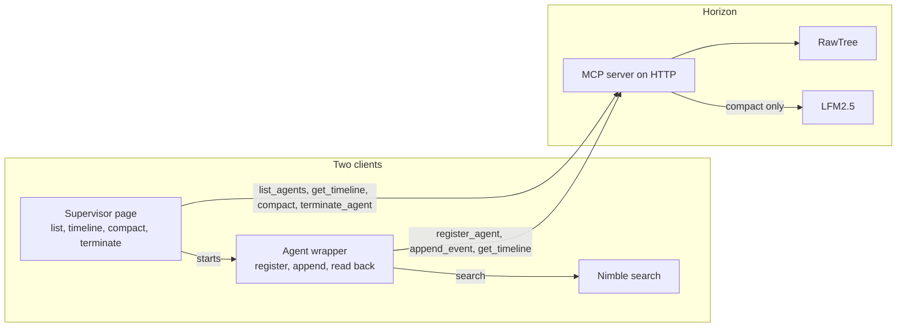
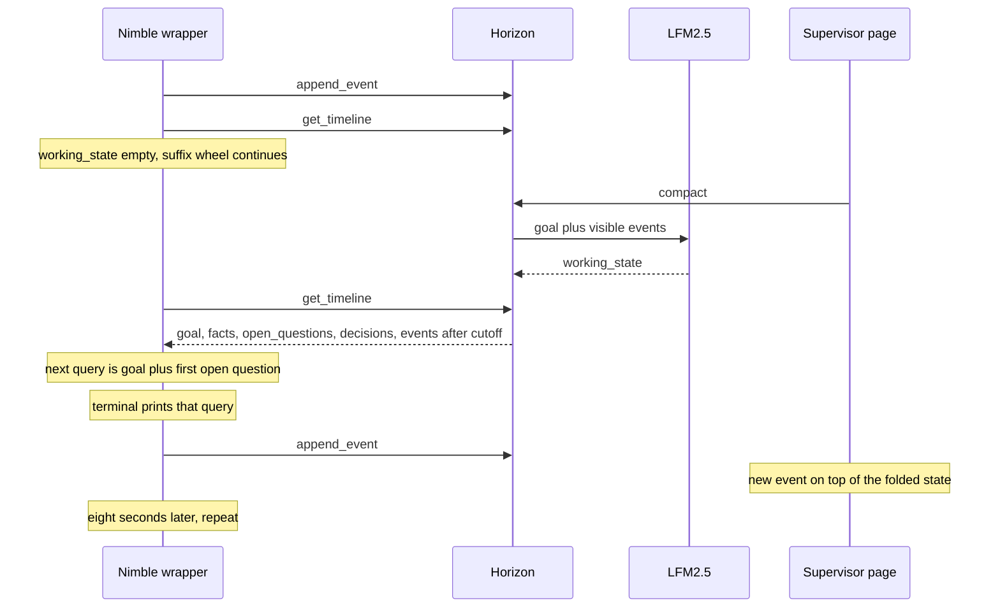

# Horizon

Horizon is the server in the middle. The supervisor and the Nimble wrapper are the only two clients, and they call different tools.

The supervisor page starts the Nimble wrapper. The wrapper registers the session, then searches and appends each result. The page lists that session, shows its timeline, compacts it, and can terminate it. LFM2.5 runs only on compact. Both clients store through the same MCP server.

The shrink loop is a later read. `append_event` stores the raw event. Compact folds the visible prefix under the session goal, which is the launch sentence. The wrapper then calls `get_timeline` and continues from `working_state` plus events after `cutoff_seq`.

`working_state` is `goal`, `facts`, `open_questions`, and `decisions`. Until Compact, that object is empty and the Nimble suffix wheel continues. After Compact, the next query is the launch sentence plus the first open question, the terminal prints it, and the page shows the new event on the folded state. The next Compact folds those new events, and the wrapper calls `get_timeline` again. The Nimble sample only registers and appends. It does not call `get_timeline`.

---

Long Horizon Agents Hackathon
San Francisco
September 25, 2026.